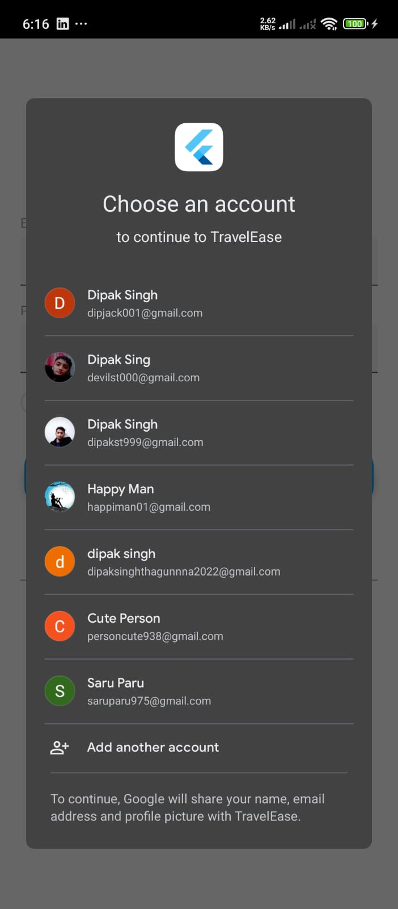
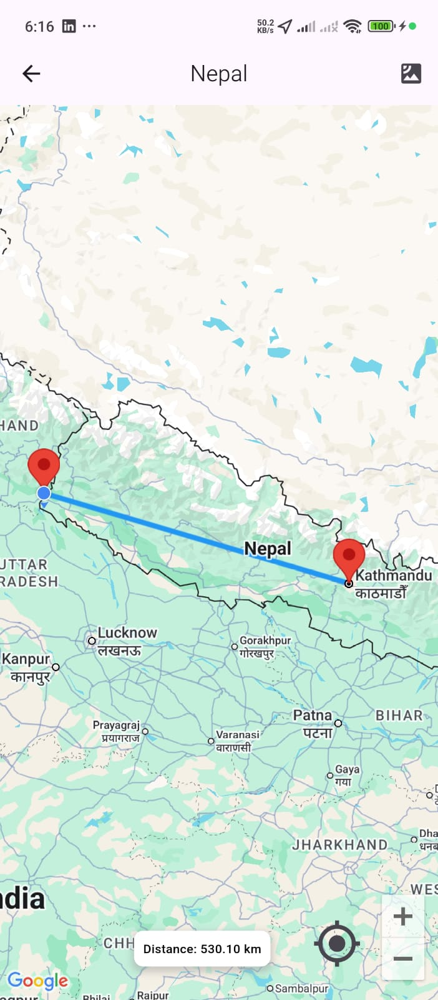
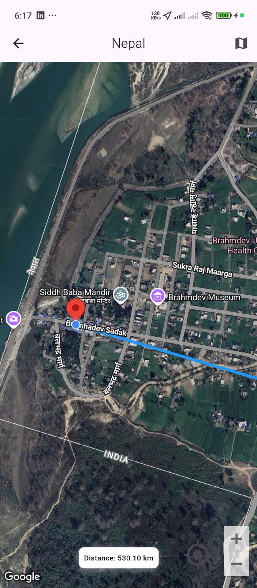

# 🌍 TravelEase – Flutter Destination App

A beautiful travel app with Firebase authentication( email and Google ), destination booking (Stripe payments), Google Map integation, beautiful Animations, profile page with profile pic upload(gallery/camera) and favorites management. Built with **Flutter** and **Provider** state management.

## 📱 Screenshots

## Authentication Flow

| Welcome Screen | Email Sign In | Sign Up |
|----------------|---------|---------|
|  |  |  |

---

## Core Features

| Homepage | Destination Details | Payment (Stripe) |
|----------|---------------------|------------------|
|  |  |  |

---

## Favorites & Profile

| Favorites | Profile | Edit Profile Details |
|-----------|---------|----------------------|
|  |  |  |

---

## 🗺️ Location & Services Integration

| Google Login Integration | Map View 1 | Map View 2 |
|--------------------|------------|------------|
|  |  |  |

---

## ✨ Key Features
- **User Auth**: Secure sign-in/sign-up flow with Firebase - Email and Google Login.
- **Stripe Integration**: Seamless payment processing.
- **Map Integration**: Google Map with Markers in own location and Destination location.
- **Favorites**: Add/remove favorite destinations with Provider.
- **Responsive UI**: Works on all screen sizes.

---

## 🎥 App Preview

Check out a video preview of the app in action:
[Watch Preview on Google Drive](https://drive.google.com/file/d/1SBpKboTml1y2MlaFi-4kQrBJVgAjh53E/view?usp=drivesdk)

---

## 🛠️ Tech Stack
- **State Management**: Provider
- **Payment**: Stripe SDK
- **Local Storage**: Hive
- **Animations**: Hero and Custom Animation 

---

## 📦 Packages Used
- **Firebase Authentication**: firebase_auth, firebase_core, firebase_secure_storage, google_sign_in
- **Image Picker**: image_picker
- **Staggered Grid View**: flutter_staggered_grid_view
- **Stripe Flutter**: flutter_stripe
- **Google Map**: google_maps_flutter , geolocator, permission_handler
- **HTTP Client**: dio
- **Hive Storage**: hive

---

## ⚙️ Installation
1. Clone the repo:
   ```bash
   git clone [https://github.com/DipakSingh0/Destination_App.git](https://github.com/DipakSingh0/Destination_App.git)
